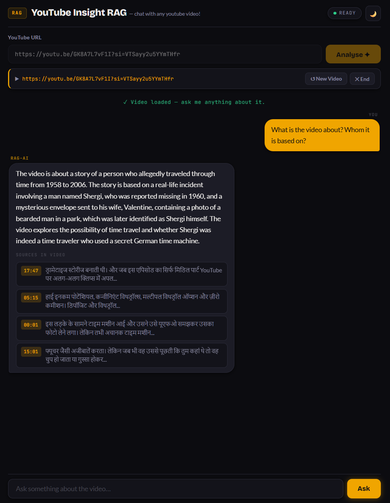
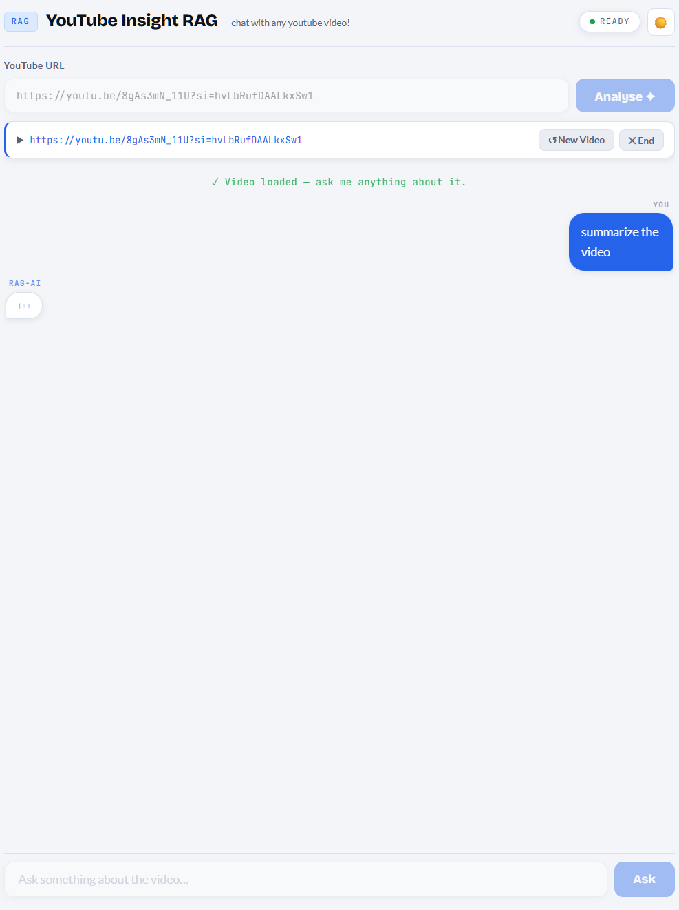
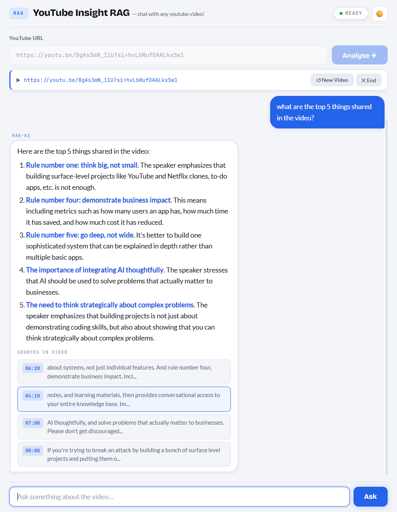

# YouTube Insight RAG

Ask questions about any YouTube video. Paste a URL, get answers with timestamps.

Built with LangChain, FAISS, LLaMA 3.1 (via Ollama), HuggingFace Embeddings, and FastAPI.

---

## Preview





<details>
<summary>Light mode</summary>



</details>

## What it does

- Fetches the transcript of any YouTube video (auto or manual captions)
- Handles English, Hinglish (Roman-script Hindi), and auto-translates other languages
- Chunks and indexes the transcript into a FAISS vector store
- Uses MMR retrieval to find the most relevant + diverse context
- Answers your questions using LLaMA 3.1 locally — no OpenAI key needed
- Remembers the last 5 exchanges so follow-up questions work naturally
- Shows clickable source timestamps so you can verify any answer

---

## Prerequisites

You need two things installed before running this project:

### 1. Python 3.10+

Check with:
```bash
python --version
```

### 2. Ollama + LLaMA 3.1

This project runs the LLM **locally** on your machine using Ollama (free, no API key needed).

**Install Ollama:** https://ollama.com/download

Then pull the model (one-time download, ~4.7GB):
```bash
ollama pull llama3.1
```

Confirm it works:
```bash
ollama run llama3.1
# Type /bye to exit
```

---

## Setup

```bash
# 1. Clone the repo
git clone https://github.com/DIN05AUR/Youtube_Insight_RAG.git
cd youtube-insight-rag

# 2. Create a virtual environment (recommended)
python -m venv venv
source venv/bin/activate        # Mac/Linux
venv\Scripts\activate           # Windows

# 3. Install dependencies
pip install -r requirements.txt
```

---

## Run

```bash
python run.py
```

Then open your browser at: **http://localhost:8000**

You'll see the chat UI. Paste any YouTube URL and start asking questions.

> **Note:** First time loading a video takes 30–60 seconds — it's downloading the transcript,
> building the vector index, and loading the embedding model. After that it's fast.

---

## How it works

```
YouTube URL
    ↓
Fetch transcript (YouTubeTranscriptAPI)
    ↓
Clean + translate if needed (deep-translator)
    ↓
Chunk into overlapping segments (LangChain TextSplitter)
    ↓
Embed + index into FAISS (all-mpnet-base-v2)
    ↓
On each question:
  → MMR retrieval (15 candidates → 4 diverse chunks)
  → Inject context + chat history into prompt
  → LLaMA 3.1 generates answer
  → Return answer + timestamp sources
```

---

## Project structure

```
youtube-insight-rag/
├── app.py           # Core RAG pipeline (transcript → chunks → FAISS → LLM)
├── api.py           # FastAPI backend (routes, session, background processing)
├── main.py          # CLI mode (use from terminal without the web UI)
├── run.py           # Starts the web server
├── requirements.txt
├── frontend/
│   └── index.html   # Single-page chat UI (dark + light mode)
└── faiss_index/     # Auto-created after first video load (gitignored)
```

---

## CLI mode (optional)

If you prefer the terminal over the browser:

```bash
python main.py
```

Commands during chat:
- `new video` — load a different video
- `clear` — reset chat memory (same video stays loaded)
- `exit` — quit

---

## Configuration

Want to change the LLM or embeddings? Edit these lines in `app.py`:

```python
# LLM — swap to any Ollama model you have pulled
llm = OllamaLLM(model="llama3.1", temperature=0.2)

# Embedding model — mpnet is fast + accurate for English
# For multilingual (Devanagari Hindi etc): "intfloat/multilingual-e5-base"
model_name = "sentence-transformers/all-mpnet-base-v2"
```

---

## Troubleshooting

**"Cannot reach API" in the browser**
→ Make sure `python run.py` is still running in your terminal.

**"No transcript available"**
→ The video has captions disabled. Try a different video.

**Slow first response after loading**
→ Normal — LLaMA 3.1 loads into memory on the first question. Subsequent answers are faster.

**Ollama connection error**
→ Make sure Ollama is running: `ollama serve` (it usually starts automatically on install).

---

## Tech stack

| Component | Library |
|---|---|
| Transcript fetch | youtube-transcript-api |
| Translation | deep-translator |
| Text splitting | langchain-text-splitters |
| Embeddings | sentence-transformers (all-mpnet-base-v2) |
| Vector store | FAISS (faiss-cpu) |
| LLM | LLaMA 3.1 via Ollama (langchain-ollama) |
| Backend | FastAPI + uvicorn |
| Frontend | Vanilla HTML/CSS/JS |
